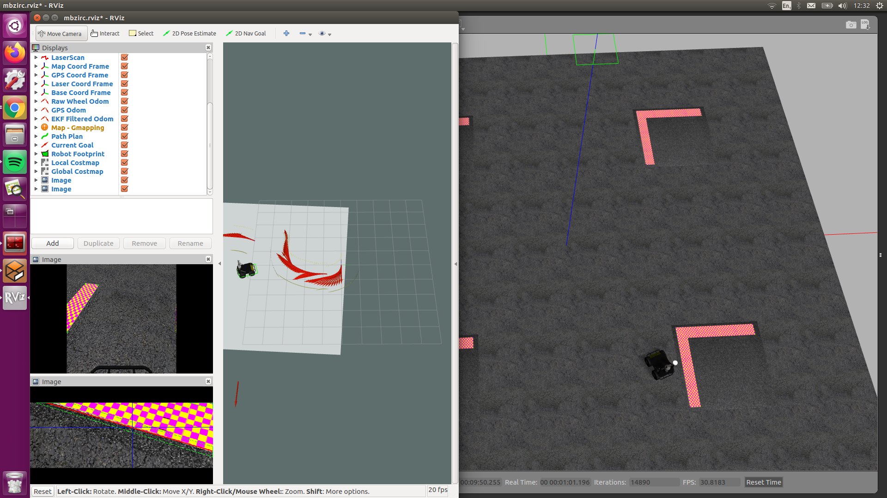
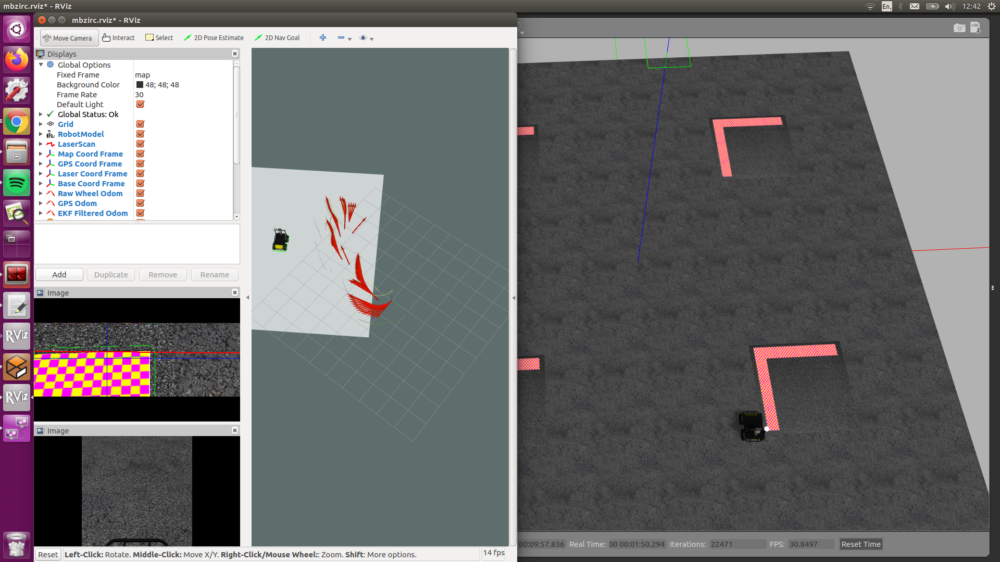
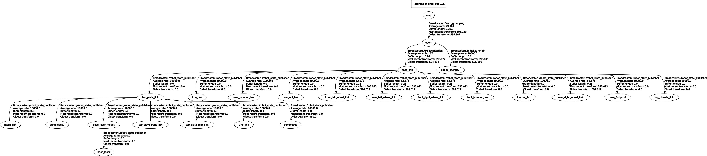
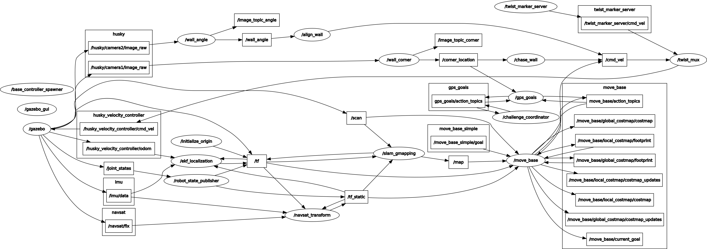

# MBZIRC_pub
The code used to simulate a ground robot on the MBZIRC challenge 2:

This stack is intented for use as example code, demonstrating: simple gps navigation, simple visual servoing using opencv as well SMACH for behaviour coordination. 

Key dependancies include: Opencv, CVBridge, SMACH and SMACH visualisation, SWRI_transform_util and all clear path husky base packages. 
The gps_goal package is very lightly modified from http://wiki.ros.org/gps_goal

To implement:  
1)copy the my_ground_plan directory to your ~/.gazebo/models folder    
2) install dependancies listed  
3) add all folders other than /images and /my_ground_plan to a catkin src folder  
4_ build catkin_ws  

To run the package:
roslaunch challenge_coordinator challenge2_launch.launch
roslaunch gps_goal initialize_origin.launch
rosrun challenge_coordinator Challenge_smach.py

This will lead the clear path husky to the corner of the magenta and yellow wall base and complete alignment.
To increment along the wall:
rosservice call /CommandMisc "flag_name: 'block'
flag_value: false
flag_value_int: 1" 

to view the behaviour of the sysytem:
rosrun smach_viewer smach_viewer.py 

tf of the working system: 

rqt_graph of working system:

some packages needed for working on a real husky on ros kientic include:
laser_filters
pointgrey_camera_driver
